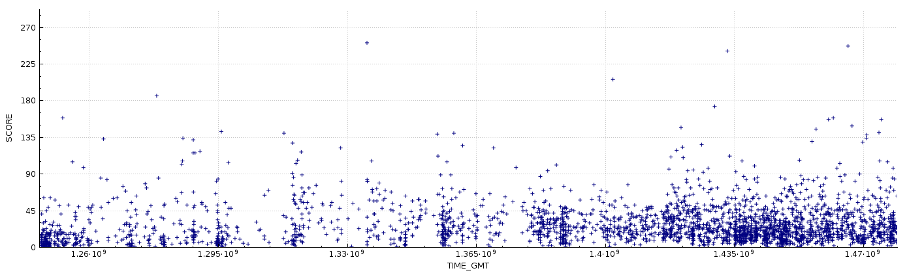

**Contents**
----------
This data repository includes an sqlite database which contains all the URLs of 
linked posts submitted to the subreddit https://www.reddit.com/r/opendirectories. 
The URLs also include various other forms of associated data, including but not 
limited to the post title, score and submit date.

For those people who only wish to use the URLs and/or do not want to use sqlite, 
a text file has also been included as a substitute. This file only includes the 
URLs which respond with a 200 status (OK), any other data reqired would have to 
be retrieved from the database file and therefore require the use of sqlite 
(see below). Other file formats will be added in future updates.

**Visualisation**

The graph below is derived from the data provided above. Each dot below
represents a linked post submission at the subreddit. The x axis represents the 
date and time of the post and the y axis represents the total score of the post 
(upvotes - downvotes).

**Updates**
---------

This repository will be update on the first of every month, whereby all the 
associated data files will be updated with new data obtained from the previous 
month. ID order is not guaranteed to be preserved.

**Roadmap**

* Inlcude JSON and CSV file formats

* ~Include a http response field , i.e 200, 404 ect.~

**Access**
---------
If you are unfamiliar with programming then it is advised that you simply try to 
use the text file provided. If you require any of the other data fields in text 
form please get in contact with me at my github emails address.

The database file 'opendirectories.db' requires the use of sqlite to manipulate,
if you wish to simply view the database, proceed to the section following this 
one. sqlite3 comes as standard with python3, and this is the recommended option 
for beginners. The documentation concerning this module can be found [here](https://docs.python.org/3.5/library/sqlite3.html). It is imported as follows.

    >>> import sqlite3

If you wish to simply to view the database sqlitebrowser can be used. More 
information about sqlitebrowser can be found [here](http://sqlitebrowser.org/).
A few examples of how to install it are given below.

**Debian/Ubuntu**

    sudo apt install sqlitebrowser

**FreeBSD**

    sudo pkg install sqlitebrowser

**Fedora**

    sudo dnf install sqlitebrowser

**Arch**

    sudo pacman install sqlitebrowser

**MacOS x**

    brew cask install sqlitebrowser

**Windows**

Windows binaries can be downloaded from here:
https://github.com/sqlitebrowser/sqlitebrowser/releases

**Disclaimer**
----------

1. The information provided on this repository is to be used for educational 
purposes only. The content provider in no way condones the use of this 
information to break the law, this includes but is not limited to any form 
of identity theft, intent to gain unauthorised access to computer material and 
copyright infringement.

2. The content creator is in no way responsible for any illegal activity or
damages generated from the use of this information. The information provided 
should not contain any personally identifying material, if this is found to be 
the case it should be reported to the content creator immediately for removal.
The information provided is intended to be used as an educational tool to 
educate the public on information security.

3. Except as expressly stated in this Agreement, all materials and information 
delivered on this repository are provided as is and are subject to change. 
Except as expressly stated in this agreement, neither party makes any 
representations or warranties of any kind concerning the information provided, 
expressed or implied.

**Authors**
----------

Reuben Thorpe

