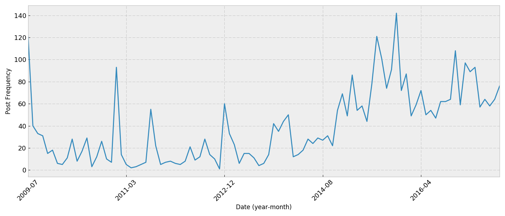
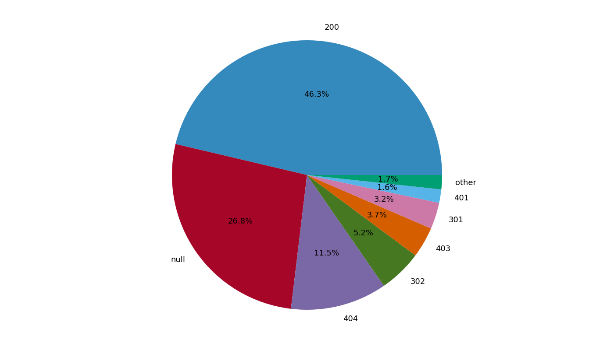
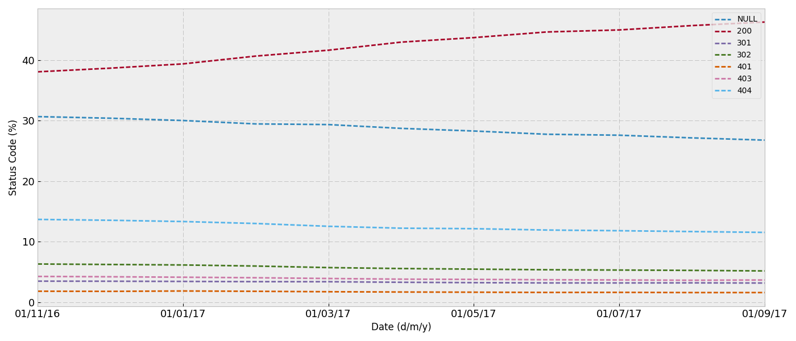

**Contents**
----------
This data repository includes a sqlite database which contains all the URLs of 
linked posts submitted to https://www.reddit.com/r/opendirectories. The URLs 
also include various other forms of associated data, including but not 
limited to the post title, score and submit date. Multiple CSV files have also 
been included which represent each table im the database, they can be found 
[here](subsets/).

For those people who only wish to use the URLs and/or don't know how to use the 
other file formats, a text file has also been included as a substitute. This 
file only includes the URLs which respond with a 200 status (OK), any other 
data required would have to be retrieved from either the database or CSV file.

**Visualisation**

All the graphs present below are generated from the dataset within this 
repository. The code used to generate them can be found 
[here](scripts/generate_graphs.ipynb), they are generated automatically each 
month so if there are any visual artifacts please contact me via my email. 
The plot below shows how the frequency of posts changes from month to month 
on the subreddit. The x axis is broken down into months and the y axis 
represents the total number of posts made during that period.

The next graph represents a breakdown of all the server status response codes 
received from the URLs this month. It can be seen that status code 200 (OK) and 'null' 
generally dominate the results. 'null' here signifies that the server could not be 
connected to at all. The 'others' field is a combination of status codes which 
comprised less than 1% of the total result. The code to generate this graph can be 
found [here](scripts/generate_graphs.ipynb).

This next graph breaks down the most common url paths used by open directories. 
It does not include empty paths '/' and captilisations are retained. The code to
generate this graph can be found [here](scripts/generate_graphs.ipynb).

The next graph shows the historic percentage of server response codes
recieved from the complete collection of URLs. Any status code which has never 
contributed to more than 1% of all the URLs is not shown. The code to generate 
this graph can be found [here](scripts/generate_graphs.ipynb).

**Updates**
---------

This repository will be updated on the first of every month, whereby all the 
associated data files will be updated with new data obtained from the previous 
month. ID order is not guaranteed to be preserved.

**Roadmap**

* ~~Include CSV format~~

* ~~Include a http response field , i.e 200, 404 ect~~

**Access**
---------
If you are unfamiliar with programming then it is advised that you simply try to 
use the text file provided. If you require any of the other data fields in text 
form please get in contact with me at my github emails address.

The database file 'opendirectories.db' requires the use of sqlite to manipulate,
if you wish to simply view the database, proceed to the section following this 
one. sqlite3 comes as standard with python3, and this is the recommended option 
for beginners. The documentation concerning this module can be found [here](https://docs.python.org/3.5/library/sqlite3.html). It is imported as follows.

    >>> import sqlite3

If you wish to simply to view the database sqlitebrowser can be used. More 
information about sqlitebrowser can be found [here](http://sqlitebrowser.org/).
A few examples of how to install it are given below.

**Debian/Ubuntu**

    sudo apt install sqlitebrowser

**FreeBSD**

    sudo pkg install sqlitebrowser

**Fedora**

    sudo dnf install sqlitebrowser

**Arch**

    sudo pacman install sqlitebrowser

**MacOS x**

    brew cask install sqlitebrowser

**Windows**

Windows binaries can be downloaded from here:
https://github.com/sqlitebrowser/sqlitebrowser/releases

**Disclaimer**
----------

1. The information provided on this repository is to be used for educational 
purposes only. The content provider in no way condones the use of this 
information to break the law, this includes but is not limited to any form 
of identity theft, intent to gain unauthorised access to computer material and 
copyright infringement.

2. The content creator is in no way responsible for any illegal activity or
damages generated from the use of this information. The information provided 
should not contain any personally identifying material, if this is found to be 
the case it should be reported to the content creator immediately for removal.
The information provided is intended to be used as an educational tool to 
educate the public on information security.

3. Except as expressly stated in this Agreement, all materials and information 
delivered on this repository are provided as is and are subject to change. 
Except as expressly stated in this agreement, neither party makes any 
representations or warranties of any kind concerning the information provided, 
expressed or implied.

**Authors**
----------

Reuben Thorpe

